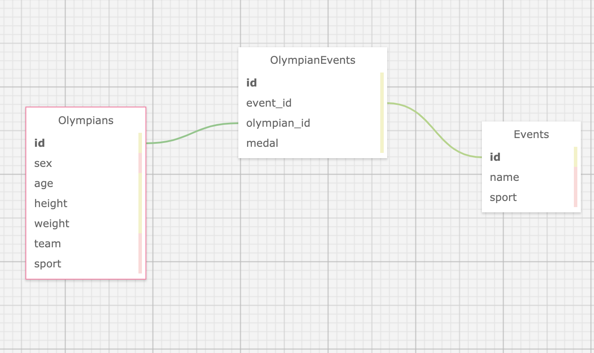

# Koroibos

The Koroibos API represents the final solo project of the fourth quarter of the Back-End Engineering program at the Turing School of Software and Design. The API uses backend JavaScript technologies (NodeJS and Express).

The API can be generally described as a statistics API, where users can call on a number of endpoints that return information about the athletes and events at the 2016 Summer Olympics. Learning goals for this project include:

* Ultimately, demonstrating knowledge we've gained throughout Turing
* Using an agile process to turn well defined requirements into deployed and production ready software
* Gain more experience using continuous integration tools to build and automate the deployment of features in various environments
* Build applications that execute in development, test, CI, and production environments
* Build an API within a time-block

The API is deployed to Heroku, and is located at:
https://koroibos-m.herokuapp.com/
## Local Setup
Feel free to clone this API's repository. Once cloned, run the following commands to install the necessary packages and set up the application.

#### Basic Setup
1. `clone` down this repo
2. `cd` into koroibos
3. Run `npm install` to install dependencies

#### Database Setup
1. `npx sequelize db:create`\
2. `npx sequelize db:migrate`\
3. Run `node data/import.js` to seed the database

#### Usage
1. Run `npm start`
2. Follow the instructions below to his the endpoints.

## API Endpoints

This API focused primarily on Olympians, their events, and the statistics that come from them. Therefore, there are tables for Olympians and Events, as well as a joins table for OlympianEvents.

The following six endpoints comprise the totality of the API thusfar. After following the instructions listed above, visit them locally at http://localhost:3000 or remotely at https://koroibos-m.herokuapp.com .

#### Olympians
User is provided records of all Olympians
```
  GET /api/v1/olympians
```
##### Parameters
| params | Description |
|--------|-------------|
| age | User can input either YOUNGEST or OLDEST here to get a record of the Olympian fitting that description. |

##### Responses
All Olympians
```
200 OK
Link: <https://koroibos-m.herokuapp.com/api/v1/olympians>
```
```
{
  "olympians":
    [
      {
        "name": "Maha Abdalsalam",
        "team": "Egypt",
        "age": 18,
        "sport": "Diving"
        "total_medals_won": 0
      },
      {
        "name": "Ahmad Abughaush",
        "team": "Jordan",
        "age": 20,
        "sport": "Taekwondo"
        "total_medals_won": 1
      },
      {...}
    ]
}
```
Youngest Olympian
```
200 OK
Link: <https://koroibos-m.herokuapp.com/api/v1/olympians?age=youngest>
```
```
{
  [
    {
      "name": "Ana Iulia Dascl",
      "team": "Romania",
      "age": 13,
      "sport": "Swimming"
      "total_medals_won": 0
    }
  ]
}

```
Oldest Olympian
```
200 OK
Link: <https://koroibos-m.herokuapp.com/api/v1/olympians?age=oldest>
```
```
{
  [
    {
      "name": "Julie Brougham",
      "team": "New Zealand",
      "age": 62,
      "sport": "Equestrianism"
      "total_medals_won": 0
    }
  ]
}

```
---
#### General Olympian Stats
User is provided single record of general statistics pertaining to all Olympians
```
GET /api/v1/olympian_stats
```
##### Parameters
| params | Description |
|--------|-------------|
|    |  |


##### Response
```
200 OK
Link: <https://koroibos-m.herokuapp.com/api/v1/olympian_stats>
```
```
{
   "olympian_stats": {
     "total_competing_olympians": 3120
     "average_weight:" {
       "unit": "kg",
       "male_olympians": 75.4,
       "female_olympians": 70.2
     }
     "average_age:" 26.2
   }
 }
```
---

#### Olympic Events
User is provided records of all Olympic events sorted by Sport category
```
  GET /api/v1/events
```
##### Parameters
| params | Description |
|--------|-------------|
|      |  |

##### Response
```
200 OK
Link: <https://koroibos.herokuapp.com/api/v1/events>
```
```
{
  "events":
    [
      {
        "sport": "Archery",
        "events": [
          "Archery Men's Individual",
          "Archery Men's Team",
          "Archery Women's Individual",
          "Archery Women's Team"
        ]
      },
      {
        "sport": "Badminton",
        "events": [
          "Badminton Men's Doubles",
          "Badminton Men's Singles",
          "Badminton Women's Doubles",
          "Badminton Women's Singles",
          "Badminton Mixed Doubles"
        ]
      },
      {...}
    ]
}
```
---

#### Olympic Medalists
User is provided records of all Olympic medalists for a specific Olympic event
```
  GET /api/v1/events/:id/medalists
```
##### Parameters
| params | Description |
|--------|-------------|
|      |  |

note: This is sample data and it is incomplete. You may not have all medalists for a particular event.

##### Response
```
200 OK
Link: <https://koroibos-m.herokuapp.com/api/v1/events/:id/medalists>
```
```
{
  "event": "Badminton Mixed Doubles",
  "medalists": [
      {
        "name": "Tontowi Ahmad",
        "team": "Indonesia-1",
        "age": 29,
        "medal": "Gold"
      },
      {
        "name": "Chan Peng Soon",
        "team": "Malaysia",
        "age": 28,
        "medal": "Silver"
      }
    ]
}
```
---
## Database

The database uses PostgreSQL, and its schema is shown below.



## Tech Stack

This application uses:
* Node version 10.16.2
* Express version 4.16.4
* Sequelize version 5.15.0
* Jest version 24.9.0
* PostgreSQL version 7.12.1

## Contributors

This was a solo project. The contributor and their GitHub account information are shown below.

Martin Mercer \
https://github.com/m-mrcr

## How to Contribute

To contribute to this project, fork the project from the
master branch. You may then make changes you deem appropriate and
submit a pull request. Please provide a detailed explanation of what feature, problem, or bug fix you are presenting.
